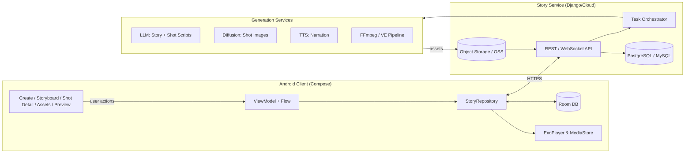

# Story2MV 架构概览

本文档描述了 Story2MV 在「故事输入 → AI 分镜 → 视频生成 → 成品导出」链路上的端到端方案，覆盖客户端、服务端以及模型服务的交互关系。

## 总体架构

### 说明
- **UI 层**：五个 Compose 页面分属不同 feature 模块，依赖 ViewModel 暴露的 `StateFlow`。
- **ViewModel 层**：负责网络/本地数据编排，触发 Repository 的 `suspend` 方法，并透传长任务状态。
- **Repository 层**：统一封装 Room、本地文件、远端 API，向上游提供领域模型 (`StoryProject`, `Shot`, `AssetItem`)。
- **Room**：缓存故事、镜头、资产；在离线或任务恢复时提供回放。
- **Media 组件**：`ExoPlayer` 播放预览，`VideoExportManager` 通过 `MediaStore` 导出视频。
- **服务端**：Django 提供 REST + WebSocket；任务编排器将 LLM、图像、音频、视频服务串联，生成的媒体落在对象存储并回写数据库。
- **模型侧**：可按需替换供应商（如字节、阿里、OpenAI），只要输出统一 JSON / 媒体路径即可。

## 数据流程
1. **Create**：客户端调用 `POST /stories`，服务端触发 LLM 生成分镜 JSON，并返回 storyId；客户端监听 `GET /stories/{id}` 或 WebSocket 推送。
2. **Storyboard**：ViewModel 订阅 `observeStory(id)`，本地无缓存则拉取远端；【生成视频】调用 `POST /stories/{id}/video`.
3. **Shot Detail**：编辑 Prompt/旁白/转场后 `PATCH /stories/{id}/shots/{shotId}`；点击生成图像则调用 `POST /shots/{id}:regenerate` 并监听状态。
4. **Assets**：查询历史视频 `GET /assets?query=...`，列表项点击即进入 Preview。
5. **Preview**：拉取远端合成结果的视频 URL，`ExoPlayer` 播放；导出调用本地 FFmpeg（`VideoExportManager`）复制到 `MediaStore`。

## 任务/模块拆分
| 模块 | 负责人 | 主要目录 | 说明 |
| --- | --- | --- | --- |
| Create | Feature 团队 A | `ui/screen/CreateScreen.kt` `ui/viewmodel/CreateViewModel.kt` | 负责 LLM 输入、风格选择、loading/错误提示、导航。 |
| Storyboard | Feature 团队 B | `ui/screen/StoryboardScreen.kt` `ui/viewmodel/StoryboardViewModel.kt` `ui/navigation/StoryNavGraph.kt` | 负责分镜展示、跳转、触发视频任务、状态监听。 |
| Shot Detail | Feature 团队 C | `ui/screen/ShotDetailScreen.kt` `ui/viewmodel/ShotDetailViewModel.kt` | 负责镜头编辑、过渡效果、重新生成、进度提示。 |
| Assets | Feature 团队 D | `ui/screen/AssetsScreen.kt` `ui/viewmodel/AssetsViewModel.kt` | 负责资产检索、网格展示、最简预览跳转。 |
| Preview & Export | Feature 团队 E | `ui/screen/PreviewScreen.kt` `ui/viewmodel/PreviewViewModel.kt` `media/VideoExportManager.kt` | 负责播放器控制、导出、导出状态提示。 |

## 扩展建议
- 引入 `Retrofit` + `OkHttp` 并在 Repository 层添加远端数据源，逐步替换当前的本地 mock。
- 使用 `WorkManager` 或 `CoroutineScope + ForegroundService` 保障视频生成期间的任务存活。
- 通过 WebSocket / Server-Sent Events 推送视频合成进度，Storyboard 层只需监听状态变更即可。
